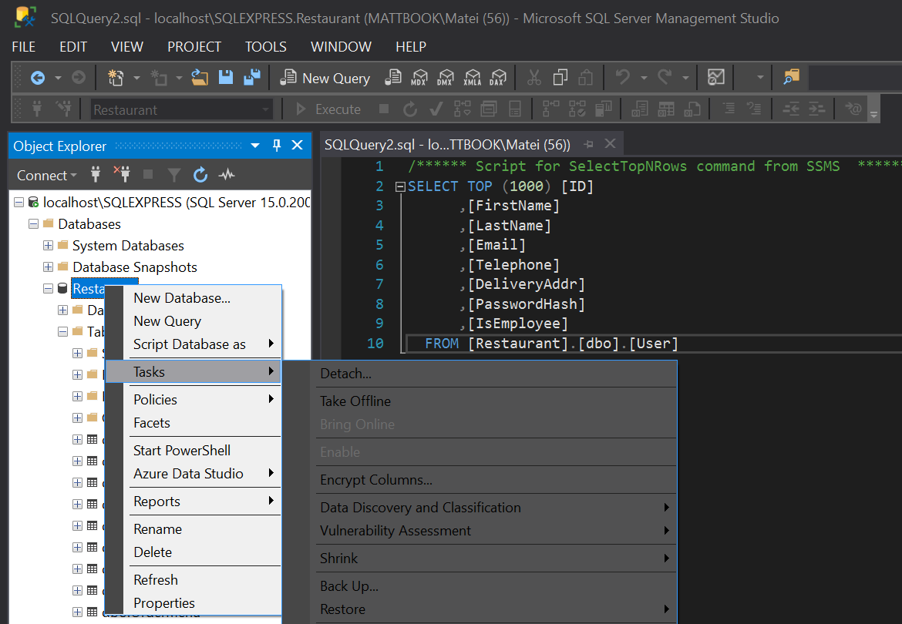

# SQL Server Management Studio: dark theme hack

This guide installs the `Color Theme Editor for Visual Studio 2019` by Microsoft DevLabs for use inside SSMS. This hacky customization works because both VS and SSMS use the same shell.

- To install the extension and my custom theme, put this folder inside `C:\Program Files (x86)\Microsoft SQL Server Management Studio 18\Common7\IDE\Extensions`.

- Alternatively, make the folder yourself. Download the extension from [here](https://marketplace.visualstudio.com/items?itemName=VisualStudioPlatformTeam.VisualStudio2019ColorThemeEditor) and extract the VSIX file as an archive (do not install it), place [my theme](Dark.pkgdef) inside the extracted folder and move it to the aforementioned path.

- Open SSMS and select the `SSMS Dark` theme from `Tools > Customize colors`.

- Profit!

